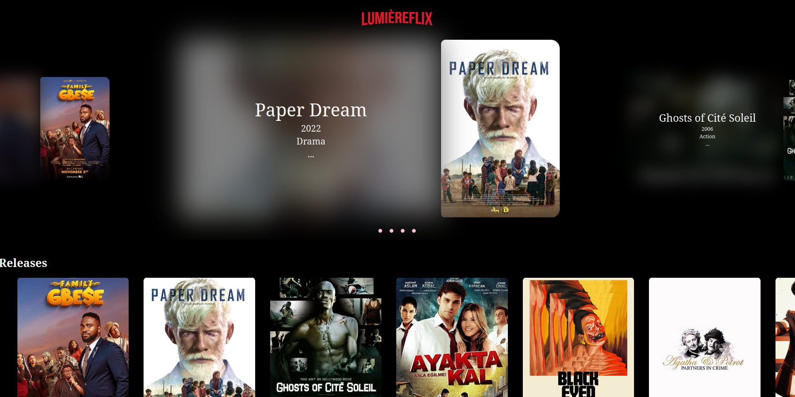

### Hi wellcome to my github 👋

  I'm a computer science student from Brazil, current in 5th semester, I have interest in Web development, mobile development and I really want to do something related to sports and/or health care like apps, image processing, data analysis, Iot, etc.

  
  - 🔭 I’m currently working on a laboratory in my college where I am part of the team that develops an application in partnership with Lenovo and working in some personal projects
  - 📫 How to reach me: rafaelfacundo63@gmail.com

  

  

  This is my latest mobile project. It's an app for a fictional bank that I created, MuBank. It's a very simple application, only featuring bank transfers. For the frontend, I used React Native and some auxiliary libraries like Axios, Redux, and i18n, the latter for translating the app's texts into multiple languages. On the backend, I used Node.js, Express, and Sequelize. As for the database part, I created a relational database with PostgreSQL, using Docker to host the development database. I learned a lot from this project, and I'm eager to tackle even more complex projects from now on. I DID NOT FINISH THIS APP AND STILL WORKING ON IT.

This is my current project that I am working on. I started recently, so it is still in the early stages, but basically, it is a website that consumes a movie API. When the user selects a movie, the frontend sends a request to the backend, which downloads the movie and streams the data in real time. I will not make the backend of the application available for legal reasons. I am doing it just for the knowledge.

